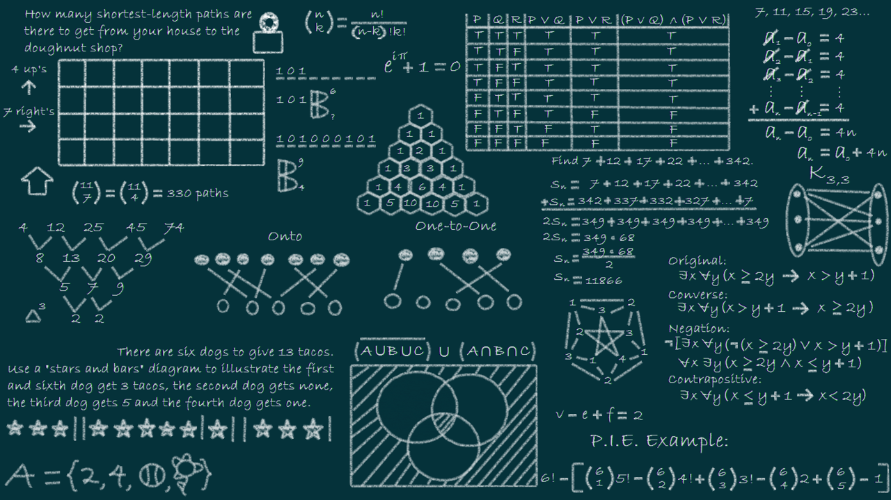

# Estructura de Datos Aplicadas

En este  **Repositorio** se encuentra infromación de estructura de datos en Java, JavaScript y Python

1. Conceptos Básicos
1. Aregglos
1. Listas Enlazadas
1. Pilas y Colas
1. Arboles Binarios

**Jaime Aldair Andrade Rojo**